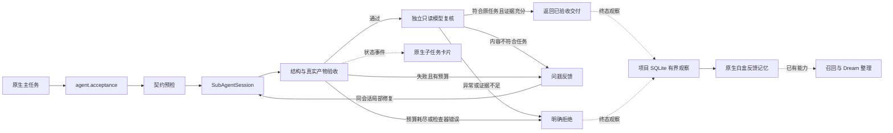

# PilotDeck · 子任务验收与局部修复

**让每次交付，都有验收依据。** 为启用契约的子任务加入结构检查与独立模型复核；可修问题在原子任务内有界修复，已通过的兄弟任务继续保留。

方向三参赛项目，基于 [OpenBMB/PilotDeck](https://github.com/OpenBMB/PilotDeck) 的底层改进。保留原生界面、模型接入和工具执行链，通过 `agent.acceptance` 启用交付契约。上游基线：`8ba2eb04cefec52fd9068d46a1a0d18b47689bea`。原说明见 [README.upstream.md](README.upstream.md)，许可证见 [LICENSE](LICENSE)。

## 现场看什么

在改版 PilotDeck 本体中演示两类失败：报表数值错误由宿主规则拦截；供应风险简报虽符合 JSON 格式，却与源数据矛盾，由独立评审模型读取实际文件后拒绝。真实子任务在原会话中修复，成功的兄弟任务保留。演示明确预置错误，所有评审与修复现场调用模型。

- **交付可检查**：结构与宿主规则先检查，再由只读模型核对原任务、交付声明和实际文件。
- **修复有边界**：同一子任务、会话和权限继续执行，共享总轮次上限；耗尽后明确拒绝。
- **经验可审查**：把成功与拒绝的验收元数据写入原生白盒记忆，按实际模型与契约分组，保留样本分母；不自动修改验收标准。
- **过程可核对**：原生子任务卡片展示验收与修复状态，保留问题、修复次数、工具轨迹和产物。

轨迹回放页用于讲解或备用，现场主线是原生软件中的真实执行。

[8 步现场操作](docs/verified-subtasks/QUICKSTART.zh-CN.md) · [原生演示录像（1 分 58 秒 / 9 分 47 秒）](https://github.com/changer-changer/PilotDeck-Verified-Subtasks/releases/tag/demo-recording-20260911) · [本次录像的验收报告](docs/verified-subtasks/evidence/ui-recording-20260911/README.md)

[现场答辩 Q&A：32 题、图表、搜索与大字投屏](https://changer-changer.github.io/PilotDeck-Verified-Subtasks/verified-subtasks/defense-qa.html) · [Q&A 离线文件](docs/verified-subtasks/defense-qa.html) · [四模型统计报告](docs/verified-subtasks/STATISTICS.zh-CN.md) · [原始数据与实验脚本](https://github.com/changer-changer/PilotDeck-Verified-Subtasks/releases/tag/statistics-20260912)

已有 L1 实验中，Llama 3.2 3B 在 450 组配对合成任务上从 17/450 提升至 161/450（3.8% → 35.8%，增加 32 个百分点）；四模型 A/B 合计 1,450 对。收益依赖模型与任务，MiniCPM 1B、Qwen 1.5B 未显著提升。统计未启用 L2，不作为双层评审整体收益或竞品性能排名。

Claude Code、Codex 与 OpenCode 都已有审查或扩展能力。本项目的差异是把验收契约、同会话局部修复、共享预算、原生状态和白盒观察接入 PilotDeck 的交付流程。详见 [竞品问答与官方依据](docs/verified-subtasks/DEFENSE-QA.zh-CN.md)；[数据复核与复跑说明](docs/verified-subtasks/STATISTICS-REPRO.zh-CN.md) 提供可解析版本与文件指纹映射。

## 安装与启动

需要 Node.js **22.13–22.x**、pnpm **10.32.1**。

```bash
corepack enable
pnpm install --frozen-lockfile
npm run build
```

普通启动仍为 `npm run dev`。原生设置 **Agent → 交付评审** 可启停第二层、单独选模型、调整评审轮次与超时。不指定评审模型时跟随实际派发任务的主对话模型；不会默认改用生产子任务的模型。模型池负责端点与密钥配置。

隔离现场演示支持任意兼容 OpenAI 的工具调用模型。通过本地环境设置 `PILOTDECK_DEMO_BASE_URL`、`PILOTDECK_DEMO_API_KEY`、`PILOTDECK_DEMO_MODEL`，运行：

```bash
node --import tsx scripts/verified-subtasks-native.ts ui --semantic-fault --acceptance-memory
```

也可使用智谱 Coding Plan 的 `ZHIPU_API_KEY`：

```bash
node --import tsx scripts/verified-subtasks-native.ts ui
```

若已经在 OpenCode 登录智谱 Coding Plan，可显式复用本地凭据：

```bash
node --import tsx scripts/verified-subtasks-native.ts ui --opencode-auth
```

启动器打印工作目录、任务文本路径和本地界面地址。在 PilotDeck 选择该工作目录，新建任务并粘贴 `现场任务.txt`。保持默认权限并允许本次文件操作。每次启动创建新目录，不改写现有配置或旧证据；凭据不保存到产物。

不启动界面，直接验收同一原生网关链：

```bash
node --import tsx scripts/verified-subtasks-native.ts live --opencode-auth
```

无需模型凭据的确定性机制验证：

```bash
node --import tsx scripts/verified-subtasks-benchmark.ts artifacts/verified-benchmark
```

## 改了哪里



| 模块 | 改进 |
|---|---|
| `src/agent/sub/acceptance/` | 有限 schema 预检、产物检查、问题归一化、宿主检查器注册 |
| `SubAgentSession` / `AgentLoop` | 同会话修复、总轮次预算、中断与错误传播、累计用量 |
| `agent` / `ToolRuntime` | 契约透传、结构化验收结果、拒绝作为真实工具失败 |
| 网关与原生 UI 桥接 | 宿主规则加载、评审模型设置、验收与修复状态、最终判定保留 |
| `AcceptanceMemory.ts` | 终态元数据桥接、去重、分母统计、原生反馈条目、清除与 Dream 文件整理兼容 |
| `modelReviewer.ts` | 独立只读会话、实际读取证据、模型继承与覆盖、评审结果与用量 |

启用是显式的：不带 `acceptance` 保留原行为。宿主注册业务检查器，模型只能引用名称。原生启动通过 `PILOTDECK_ACCEPTANCE_CONFIG` 加载批准的 JSON 产物规则，SDK 也支持自定义可信检查器。

本轮开启验收记忆的完整预演：**215.664 秒，4/4 通过，1 次格式修复与 1 次语义修复，4 条观察写入原生记忆**；三份正确报表保持不变。[包含失败实验的本轮证据](docs/verified-subtasks/evidence/acceptance-memory/README.md)。

## 验收经验记忆

在原生设置 **Agent → 记忆**开启白盒记忆后，**Agent → 交付评审 → 保存验收经验到项目记忆**控制记录。配置为 `memory.captureAcceptance`，省略时在已启用记忆的项目内默认记录；设为 `false` 可关闭。原生 Memory 面板可查看“子任务验收经验”。

观察器记录真实验收终态的元数据，不保存任务正文、交付内容和自由文本评语；最近 128 条去重观察保存在项目 SQLite，原生反馈 Markdown 是派生摘要。Dream 整理文件不会覆盖原始观察；清空项目记忆会一起删除。观察写入失败只发警告，不改验收判定。原生会话记忆本来的记录策略不因此改变。

记录本身不增加模型调用；原生检索和 Dream 仍可能调用模型。当前是可审查经验入口，不自动改契约，不宣称已提高跨任务成功率。没有终态报告的异常/取消运行不进入该观察窗口，不能把窗口当成所有请求的可靠性统计。

[现场演示与答辩手册](docs/verified-subtasks/FIELD-GUIDE.zh-CN.md) 包含逐分钟操作、讲稿、工作量与证据对应、问答和备用流程。

## 证据与边界

比赛 GLM-5.3 原生实跑：**4/4 交付通过，1 次模型拒绝触发局部修复，3 份成功报表的哈希和修改时间保持不变**。错误简报首次结构检查通过；独立模型读取源文件和交付文件后拒绝，同一子任务修复后再次通过。整轮 160.474 秒；评审本身使用 13 次模型调用。这是明确故障注入的一次完整验证，不是自然错误率或平均性能结果。[逐次报告与失败实验](docs/verified-subtasks/VALIDATION.zh-CN.md)。

第一层机制的历史对照（未启用模型复核）：相同三任务、同一初始错误、相同总请求上限。第二层复核会增加模型调用，下面数字不能用来宣称双层方案的整体成本：

| 策略 | 产物通过 | 模型请求 | 文件写入 |
|---|---:|---:|---:|
| 仅验收 | 2/3 | 6 | 3 |
| 整批重跑 | 3/3 | 15 | 6 |
| 局部修复 | 3/3 | 9 | 4 |

**在该预置故障中，相比整批重跑减少 40% 请求。** 文件工具、AgentLoop 和修复循环真实执行，模型响应采用脚本注入。这是机制证据，不是通用性能承诺。

三题自然响应实测：MiniCPM5-1B 首次及修复后均 0/3；GLM-5.3-Flash 首次 3/3，未触发修复。失败结果保留，不据此推断一般成功率。

不提供全局回滚、外部副作用恰好一次、共享文件冲突协调或跨进程恢复。业务可信度取决于宿主规则与评审质量；模型复核仍可能误判。文件交付若没有成功独立读取，不会被评审器接收；这不等于对所有业务事实的形式化证明。

关键测试：

```bash
node --import tsx --test tests/agent/sub/acceptance/*.spec.ts tests/agent/sub/VerifiedSubagent.spec.ts tests/agent/sub/AcceptanceInvariants.spec.ts tests/agent/sub/ModelReview.spec.ts tests/pilot/config/acceptanceReview.spec.ts tests/tool/VerifiedAgent.spec.ts tests/gateway/VerifiedSubtaskEvents.spec.ts
```

[现场演示说明](docs/verified-subtasks/DEMO.zh-CN.md) · [验证记录](docs/verified-subtasks/VALIDATION.zh-CN.md) · [技术细节](docs/verified-subtasks/README.zh-CN.md)
