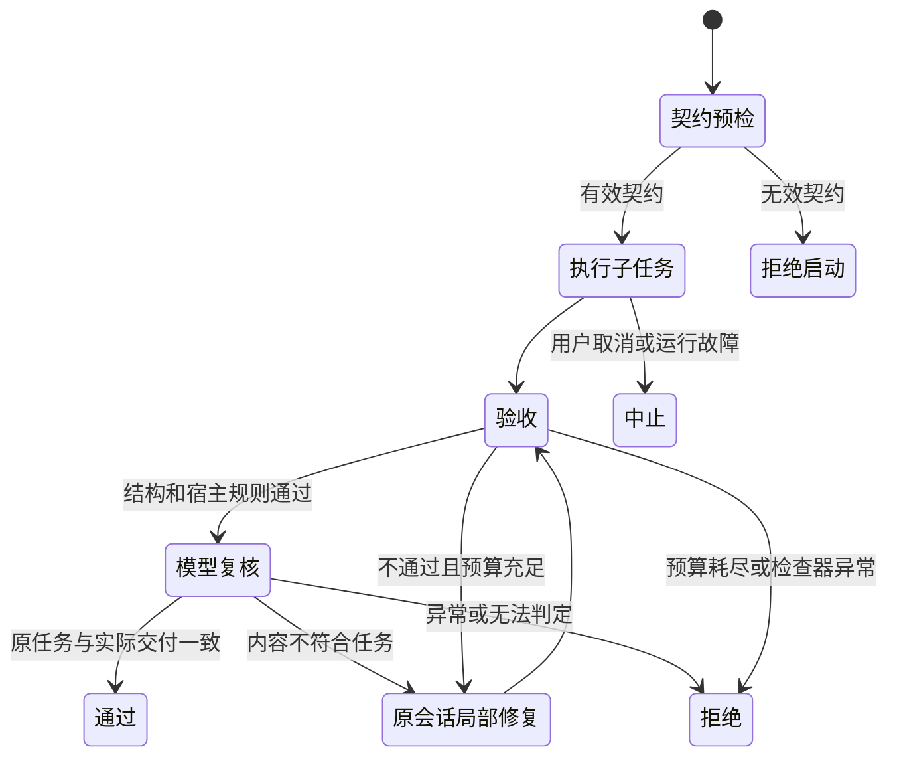

# PilotDeck · 子任务验收与局部修复

比赛方向三：改进底层 Harness。给现有 `agent` 子任务工具增加可执行的交付契约：验收输出和实际产物，失败后在原子任务中继续修复，最后明确返回通过或拒绝。

## 解决的问题

原有子任务以最终文字报告结束。模型说“完成”并不能证明文件正确、字段齐全或计算符合要求。主任务往往要自己检查、解释错误、重新分派；粗粒度重试还会重复执行已经成功的兄弟任务。

新实现让框架承担检查和有界修复。它直接进入 `SubAgentSession` 和 `AgentLoop` 的执行链，不依赖某个特定模型，也无需另建一套代理框架。

## 快速运行

需要 Node.js 22.13–22.x、项目依赖。全新克隆先按仓库 README 安装依赖。

```bash
node --import tsx --test tests/agent/sub/acceptance/evaluate.spec.ts tests/agent/sub/VerifiedSubagent.spec.ts tests/tool/VerifiedAgent.spec.ts
node --import tsx scripts/verified-subtasks-benchmark.ts artifacts/verified-demo-$(date +%s)
```

第二条命令在一个新目录中生成真实 JSON 文件和完整验收轨迹。模型响应采用确定性故障注入，文件工具、权限执行、AgentLoop、验收与局部修复均为真实代码。它验证机制，不代表真实模型的平均成功率。

本地 Ollama 已有 MiniCPM 时可运行：

```bash
node --import tsx scripts/verified-subtasks-live.ts artifacts/verified-live-$(date +%s)
```

默认模型为 `hf.co/openbmb/MiniCPM5-1B-GGUF:Q4_K_M`。可通过 `VERIFIED_SUBTASK_MODEL` 和 `VERIFIED_SUBTASK_OLLAMA` 指定已部署的模型与服务。脚本不会下载模型。真实模型实验使用三道数据处理任务；初次回答在局部修复对照中原样重放，保留其逻辑 token 成本，后续修复请求真实调用模型。不比较重放后的墙钟时间。

## 使用接口

在普通 `agent` 调用中添加 `acceptance`：

```json
{
  "description": "核算已支付订单",
  "prompt": "根据所附订单计算去重后的订单数和总金额，返回 JSON。",
  "subagent_type": "general-purpose",
  "acceptance": {
    "schema": {
      "type": "object",
      "properties": {
        "count": { "type": "integer", "minimum": 0 },
        "total": { "type": "number", "minimum": 0 }
      },
      "required": ["count", "total"],
      "additionalProperties": false
    },
    "maxRepairs": 2,
    "maxTurns": 20
  }
}
```

不传 `acceptance` 时保留原来的五字段报告行为。启用后最终交付为 JSON，结果附带 `acceptance.status`、`stopReason`、每次验收问题、修复次数和通过后的值。拒绝结果会保留最后一次交付及错误供主任务处理；不会把“工具调用返回了”当成“交付通过了”。

`maxRepairs` 默认 2，可设 0–5；`maxTurns` 默认 20，可设 1–100，初次执行、模型复核和所有修复共享这个上限。宿主设置的更小轮次上限继续生效。已有子任务超时与取消信号贯穿整个过程。该预算是模型轮次，不能宣称为严格 token 或金额上限。

## 验证实际产物

宿主在 `AgentRuntimeDependencies.subtaskValidators` 注册检查器，然后在契约中引用名称：

```ts
const subtaskValidators = {
  artifact: artifactValidator(approvedWorkspace, "sales.json", expectedSales),
};
// 传给 AgentLoop 的 runtime dependencies。
// acceptance.validators = ["artifact"]
```

完整示例见 `examples/verified-subtasks/artifact-validator.ts` 和 `scripts/verified-subtasks-benchmark.ts`。示例检查固定文件是否存在、是否为 JSON、实际内容是否匹配源数据，以及模型报告是否与文件一致。检查器接口也可连接宿主已有的测试系统、数据库只读查询或业务断言。

检查器是受信任的宿主代码，权限与副作用由宿主负责。模型输入只能引用已注册名称，不能注入 shell 命令。检查器应尽量只读、幂等，并响应取消信号。异步检查被取消后，框架会停止等待；不响应信号的外部进程需要宿主自行终止。

若要强制某项业务验收，宿主必须选择并约束契约。让模型自行挑选一个很宽松的 schema，不能证明业务质量。格式检查通过也不等于内容真实。

## 在原生 PilotDeck 中配置产物检查

宿主显式设置 `PILOTDECK_ACCEPTANCE_CONFIG` 为一个绝对 JSON 路径，再正常启动 PilotDeck。示例：

```json
{
  "version": 1,
  "projects": [{
    "root": "/absolute/approved/workspace",
    "validators": {
      "sales-file": {"file": "sales.json", "expected": {"count": 3, "total": 186}}
    }
  }]
}
```

配置由操作者提供，建议放在任务工作目录之外。网关启动时快照加载，绑定到完全匹配的项目目录；改变配置需重启网关。它不执行脚本或任意命令。产物检查比较固定文件的真实 JSON 内容与 expected，也比较模型报告的 result 与文件。模型交付格式为 `{ "artifact": "sales.json", "result": { ... } }`，契约引用 `validators: ["sales-file"]`。

配置无效会报错；不设置此环境变量则保留旧行为。验收仍须在 agent 调用中显式启用，配置注册不等于强制所有子任务自动验收。检查器读取固定宿主批准文件，并限制文件体积和符号链接边界；它不是恶意并发文件系统的通用隔离环境。

需要动态业务逻辑的开发者可继续使用 SDK 注册可信检查器。静态 expected 适合本例可重复的报表验收；真实项目应由可信业务系统提供期望值或断言，不能让待验收模型修改标准。

没有预先固定的正确内容时，可以显式注册 `{ "file": "briefing.json", "matchClaimOnly": true }`：第一层仅核对文件是合法 JSON、声明路径正确、`result` 与真实文件一致；业务质量交给第二层复核。`matchClaimOnly` 与 `expected` 互斥，漏写两者仍会拒绝配置，不会悄悄放松标准。

带契约的子任务一旦调用 `structured_output`，就以本次值进入验收；框架不会再让生产循环继续运行后拿着旧声明验收新文件。

## 第二层：独立模型复核

原生网关对带 `acceptance` 的子任务默认启用双层检查。第一层检查结构和宿主注册的规则；仅通过后才调用评审模型。评审输入包含原始任务、交付 JSON 和有界的生产轨迹，并把交付内容作为待核对数据。评审使用独立只读会话，允许 `read_file/glob/grep` 读取证据，用受限 `structured_output` 工具提交 verdict/summary/issues；不允许写文件、命令执行或再创建子任务。结构化提交后立即结束复核，避免附带说明文字使 JSON 失效。

声明了 `artifact` 的交付必须由评审会话成功读取该实际文件，不能用生产子任务的“我读过了”替代。没有文件的结构化回答可按任务输入直接评审。业务不合格会反馈给原子任务；模型故障、输出无法解析或评审无法得出结论会明确拒绝，不能冒充通过。

原生设置 **Agent → 交付评审** 对应配置：

```yaml
agent:
  acceptanceReview:
    enabled: true
    # model: provider/model-id  # 省略即跟随派发任务的主对话模型
    maxTurns: 4
    timeoutMs: 60000
```

独立模型从现有模型池中选择，沿用模型池配置的端点与密钥。默认模型取派发时的实际主模型，包括临时切换或路由后的选择；与 `agent.subagents.default` 分开。显式选择的评审模型不会被路由器再次替换。评审最大轮次范围 1–8、超时 1–180 秒，评审消耗计入子任务的共享轮次和累计用量；修复次数不包含只读复核本身。

每次验收报告附带 `review`，保留使用模型、结论、理由、问题、实际成功读取的文件、轮次、用量和耗时。停用第二层会恢复仅结构与宿主规则验收；完全不带 `acceptance` 的旧调用仍保持原行为。对于 SDK 自建 Agent，可用 `createModelSubtaskReviewer` 创建评审器并注入 `subtaskReviewer`。

模型评审有额外时延与费用，也可能误判。当前读取边界沿用原生文件权限，非任意文件系统或外部副作用的通用沙箱。高风险业务仍应由宿主规则和最终负责人共同确认。

## 状态和错误处理



修复复用相同子任务 ID、对话、工具和读写状态；增加明确的检查反馈，不重新创建兄弟任务。使用独立产物的并行子任务最适合该机制。它不会自动回滚文件，不保证外部副作用恰好执行一次，也不协调多个子任务对同一文件的冲突。对共享产物应在主任务汇总时再验收。

## Schema 范围

使用明确、有限的 JSON Schema 子集。支持显式 `type`（也支持类型数组）、嵌套 `properties`、`required`、布尔 `additionalProperties`、`items`、`minItems/maxItems`、`uniqueItems`、`minLength/maxLength`、`minimum/maximum`、`enum`、`const`、`title/description`。不支持的关键字会在模型执行前报错；没有偷偷忽略约束。

不支持 `$ref`、`pattern`、组合 schema、自定义格式或远程 schema。预检发现常见矛盾，例如最小值超过最大值、必填字段被禁止、所有枚举值不符合类型。它不是通用逻辑可满足性证明器。

契约最多 64 KiB、24 层、1,000 个 schema 节点；交付最多 1 MiB；最多 8 个宿主检查器。反馈最多保留 20 个问题并限制长度，避免坏结果耗尽上下文。

## 对应评审维度

| 用户提供的方向三评审维度 | 本项目交付 | 验收证据 |
|---|---|---|
| 稳定性、效率或可扩展性 | 机器可判定交付；失败子任务局部继续；可插拔业务检查 | 真实文件读回、兄弟任务调用次数、模型请求与 token 记录 |
| 底层理解、技术价值、验证严谨 | 接入 agent 工具、fork、会话循环、预算、事件与界面；兼容旧接口 | 定向单测、类型检查、旧子任务回归、故障注入和小样本实测 |
| 创意与开发者价值 | 把“模型说完成”变成“框架按契约验收”，让失败反馈可执行 | 完整 API 示例、修复轨迹、明确拒绝原因 |

用户 2026-09-11 补充的方向三提交要求：公开 GitHub 仓库、海报和 README；可交互 Demo 为选择性提交；性能对比、视频、已知限制与设计图为加分材料。现场以改版 PilotDeck 本体执行为主。未提供的官方评分权重不作推测。

## 范围与结论边界

本次实现不包含跨进程恢复、持久化任务 DAG、验收缓存或全局回滚。Live Workspace 已单独归档，未并入本方案。采用业界已落地的结果约束和反馈修复机制；贡献是针对 PilotDeck 的完整接入、真实产物验收、局部执行边界及可复现验证。不能仅凭三道小样本或预设故障宣称普遍降低错误率，更不能保证比赛名次。

## 实验记录与演示

详细数字、失败样本和限制见 [验证记录](VALIDATION.zh-CN.md)。生成独立演示页面：

```bash
node --import tsx scripts/verified-subtasks-viewer.ts <实验输出目录>
```

然后打开该目录的 `index.html`。它是实际轨迹回放，不能冒充现场实跑。

用已有智谱 Coding Plan 复现 GLM 实测：

```bash
VERIFIED_SUBTASK_BACKEND=zhipu node --import tsx scripts/verified-subtasks-live.ts artifacts/verified-glm-$(date +%s)
```

该选项明确使用 OpenCode 已保存的 `zhipuai-coding-plan` 凭据（或 `ZHIPU_API_KEY`）；不输出或保存密钥。


## 验收经验回写原生白盒记忆

`SubAgentSession` 在带 acceptance 的子任务产生终态报告后调用可选 `subtaskAcceptanceObserver`。该同步旁路观察器拿到隔离契约副本、实际 request_started 模型来源、终态与各次问题代码；没有任务、交付正文或自由文本反馈。旧协议、预检抛错、取消且未产生报告的任务不记录。只读评审子会话不继承观察器。观察器异常产生固定警告，不能覆盖验收结果。

网关在 `memory.enabled: true` 且 `memory.captureAcceptance !== false` 时接入 `createAcceptanceMemoryObserver`。SDK 可自行注入观察器；未注入时无额外存储。UI 的保存开关位于 Agent → 交付评审，需要先开启白盒记忆。

原始元数据保存在本项目 SQLite 的 `acceptanceObservationsV1`；上限为最近 128 条唯一观察和 1 MiB。每次写入重新读取状态，避免清空后从缓存复活旧记录；损坏状态拒绝覆盖。原生 feedback 条目“子任务验收经验”是有界派生摘要，包含分母、首次/最终通过、未解决、基础设施错误，按契约指纹与实际模型来源分组。多模型/未知来源不归因到某一个模型，反馈后通过不证明反馈的因果效果。

Dream 可以重写或合并该 Markdown，原始 SQLite 观察不会因文件整理而改变；清空项目记忆会一起删除。`readAcceptanceMemory(service)` 和原生演示导出的 `acceptance-memory.json` 提供单独的原始观察检查入口。原生记忆文件导出包不等于包含此 SQLite 观察窗口。

写入过程无模型调用；已有原生检索、会话记忆捕获及 Dream 行为保持原有配置，可能增加模型使用。没有跨进程原子合并保证。自动合同优化与成功率提升需要独立留出实验，当前未实现、也未宣称。客观判断与现场讲述见 [完整手册](FIELD-GUIDE.zh-CN.md)。
